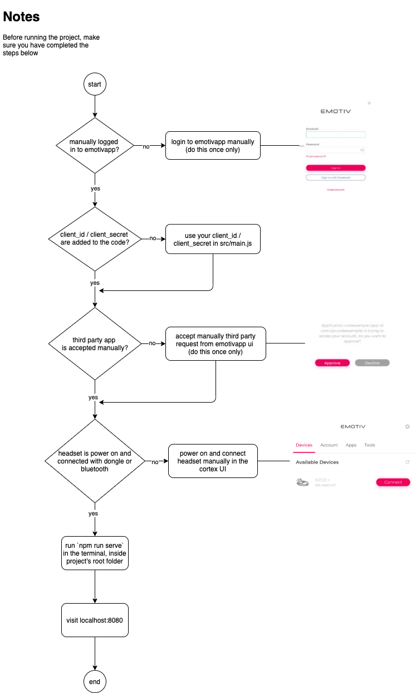

# For a better view, visit: [documentation](https://armandasvaicikauskas.gitbook.io/cst3999)

# Getting Started

## Abstract

The project's main goal was to develop a neurofeedback-assisted meditation software which will provide auditory cues if and when the subjects’ mind starts to wander. To alert the user, the application will slowly increase the volume of the meditating guide until the point when the participant returns to their centre of focus, ordinarily to conscious breathing.

The project's engine is built with Vue.js using Cortex API - the core piece of technology at EMOTIV which brings the brain**-**computer interface to consumer.

The Cortex API is built on JSON and WebSockets, making it easy to access from a variety of programming languages and platforms.

## Supported Software & Hardware

The headset I was using for this project, is called _Emotiv EPOC+_. The project has been successfully developed by using _MacOS Catalina with MacBook Pro 13" 2015_.   
Other platforms and hardware that could support this app are listed on the official [Cortex API documentation](https://emotiv.gitbook.io/cortex-api/) below 'Getting Started' article.

## Prerequisites

To be able to run this project, a few actions must be completed prior to  launching:


**Mind the fact, when trying to initialise this project, one of the EMOTIV headsets must be present.**


### Create an Emotiv ID

As with other EMOTIV services, you are required to have an Emotiv ID account. You can create an ID on [www.emotiv.com](https://www.emotiv.com/).

### Create a Cortex App

Create the **application ID** and generate the corresponding **client ID** and **client secret** for your application in order to grant access to Cortex API.

1. Login to www.emotiv.com.
2. Go to My Account Dashboard \([https://www.emotiv.com/my-account/](https://www.emotiv.com/my-account/)\).
3. Select **Cortex Apps**.
4. Read the **Developers EULA** carefully and click **Accept** only if you agree to all the terms and conditions. You cannot develop an application that works with Cortex if you do not agree to all of the terms.
5. Enter the name of your new application - an application ID will be generated automatically in the form of `com.{your-username}.{application-name}`. Note that the app ID string must contain only alphanumeric characters \(A-Z, a-z, 0-9\), hyphens \(-\), and periods \(.\).
6. Click **Register Application**. A client ID and a client secret will be presented to you. Copy them to somewhere safe immediately **as the client secret will ONLY BE SHOWN ONCE ON THIS SCREEN FOR SECURITY**. If you lost it, you will have to generate a new application ID later.



## Initiate The Project

After you have created both the Emotiv ID and the Cortex App, the next step is to start up the project. Below, you will find a detailed flowchart to help you out during the processes. **Make sure you have downloaded the code from the** [**repository**](https://github.com/armandokun/cst3999) **and the installer \(**[**Emotiv Installer V2.5.3**](https://www.emotiv.com/my-account/downloads/)**\) to follow the flow.**

According to the Cortex API documentation, you should run several methods \([requestAccess](https://emotiv.gitbook.io/cortex-api/authentication/requestaccess), [authorize](https://emotiv.gitbook.io/cortex-api/authentication/authorize), [etc](https://emotiv.gitbook.io/cortex-api/overview-of-api-flow).\) to ensure the ability for successfully carrying out the functionality of the project. Fortunately, these processes are implemented in the project already. As a result, the methods will execute automatically, when running the project by typing `npm run serve` in the terminal - inside the project's root directory. 


Most of the methods of the API will fail if you did not approve the application.


