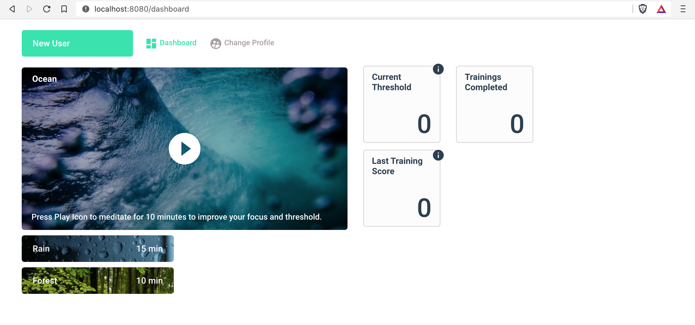
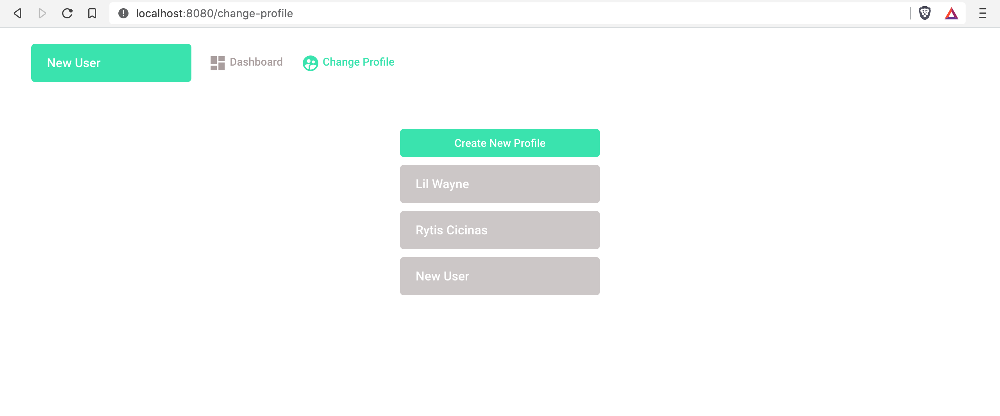
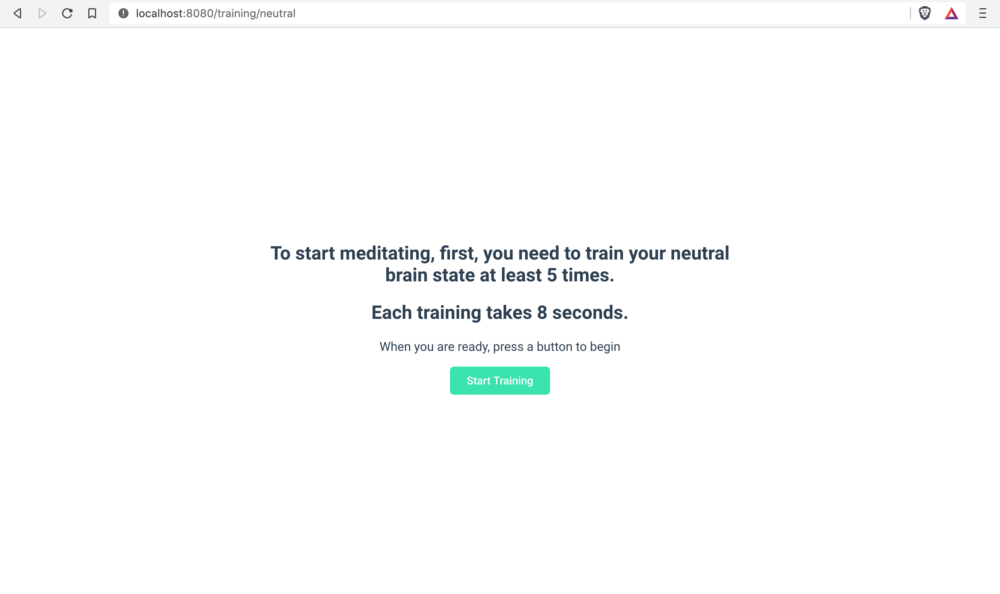
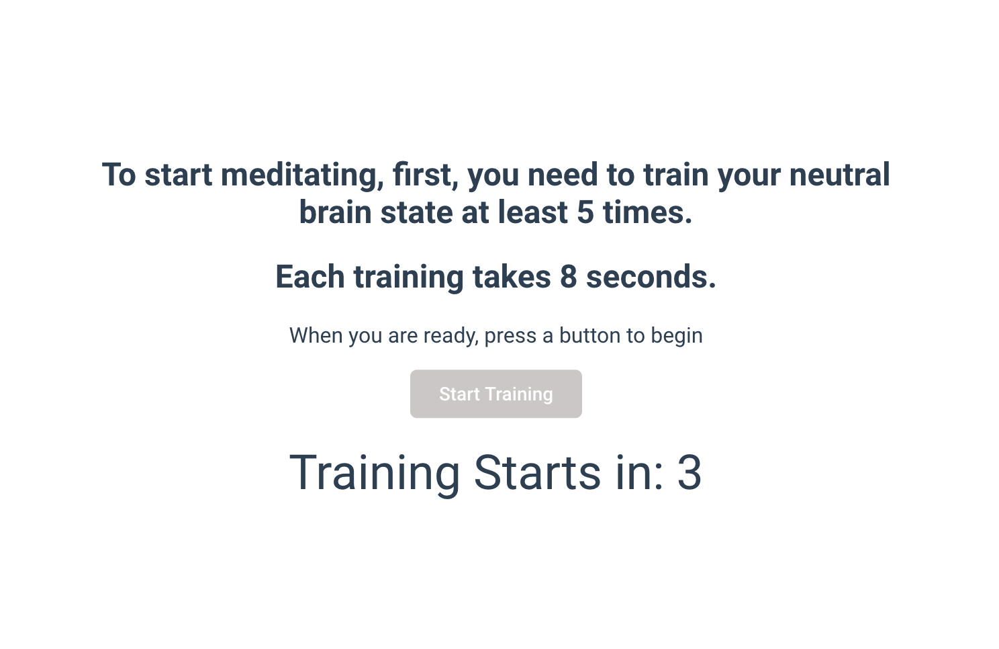
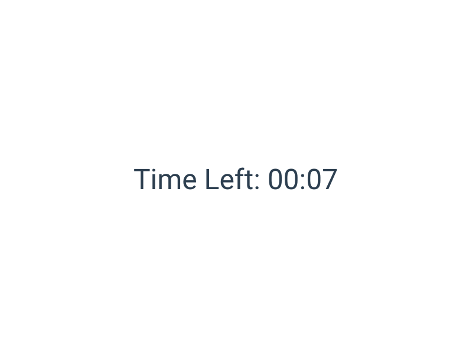
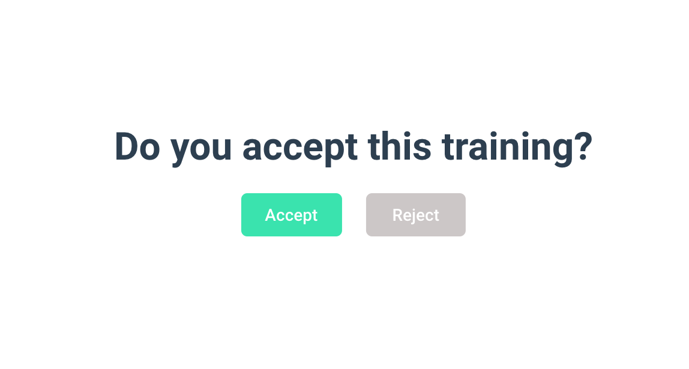
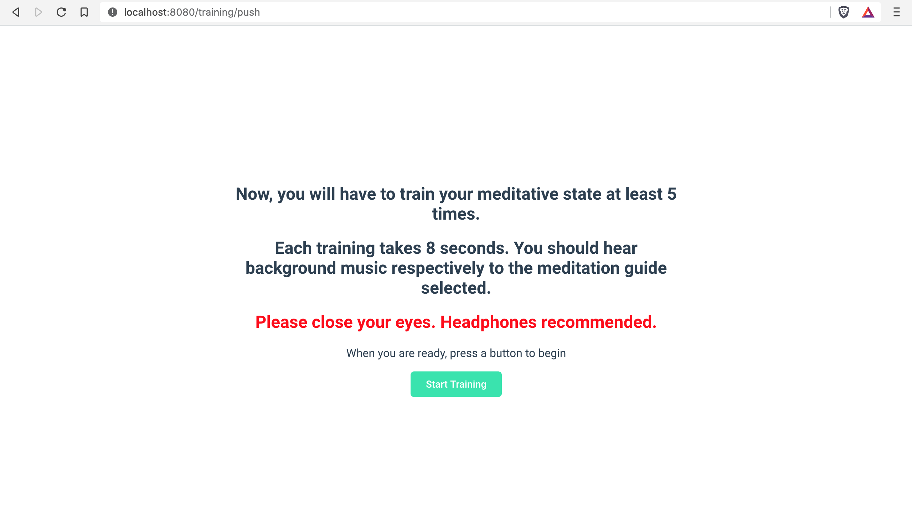

# App Guide

## Pages

This section describes each available page in the App. 

### Home

This is where the App begins. In order to start meditating, first you need to create a profile or select the existing one, if you have done it before. 

Once the profile is selected you will be redirected to the Dashboard.

### **Dashboard**

If you are joining with a new user, this is what it should look like when redirected from Dashboard. 

A similar view of the Dashboard is presented when the user \(you\) has selected a profile which completed necessary training sessions. 

As you have noticed, there are two information icons \(\) sitting on top of the information cards \(Current Threshold / Last Training Score\). Each of the icons, when hovered on top, displays the hints that are described below:

#### **Current Threshold**

The training threshold provides an indication of minimum threshold that you should target during the meditation session.

**Last Training Score**

Any meditation session score above the threshold is very likely to improve your profile. Any meditating score significantly below the threshold is likely to reduce the quality of your profile.

**Trainings Completed** displays the total of all trainings completed. Five trainings for each guide available and the other five for training the neutral brain state \(20 in total\). 

_/\*The better design choice would be, to make a total number of  Meditating Sessions Completed instead, but due to the API design, it is not possible since the Brain-Computer Interface API does not record the sessions and the data is being withdrawn from Emotiv Cloud.\*/_

#### Navigation

From the Dashboard you can access pages: Home, under _Change Profile_ link in the navigation bar and Player/Training, when pressing _Play Icon_ on the selected Meditation guide. 

Depending on the situation, whether the user has created a new profile or selected already trained one, clicking _Play Icon_ prompts different outputs. The new user will get to train their neutral brain state first by directing from the current page to the **Training** page. A trained user will be taken to the **Session** page.

### Training

This page allows users to train themselves first \(using [Training mode](training-concepts.md)\), to start meditation sessions. The App does not allow users to experience sittings before practising their neutral and selected guide brain states. The practice must be taken at least ten times, including the training with neutral brain state and the picked guide. The following is the sequence of steps that the user would normally go through.

#### Before the Training

Once the primary button is pressed, you will see a countdown from 3 seconds, informing you that the training is about to start. Each training takes 8 seconds to complete. The screen will display the countdown of 8 seconds indicating when the training has been completed. 

#### During the Training

The user will witness another countdown, indicating the time that is left to train.

#### After the Training

The participant will have to choose between accepting the training or rejecting it, to ensure the quality of the training. After selecting one of the options, the user will be prompted with a pop up box, asking whether she/he/it wants to repeat the training.

These sessions aim to establish a training threshold and let the algorithm distinguish between different brain states, like neutral and others. After adopting the neutral state, the user is ready to select one of the guides and undergo similar process. 

When both the guide and the neutral state are trained, the _Play Icon_ will redirect to the **Player** page.

### Player

During the meditation session, the app is trying to detect a brain activity pattern that you have associated with the selected guide. When detection is present, the system gathers the power of the mental command, which varies between 0-1 and saves this data to an array. Every 10 elements that are being put into the array are divided by 10 to calculate the average power of the detection. If the average is lower than 0.5, the volume will increase - causing an auditory cue for the user. In another case, the volume of the guide will be stable or climb up to the volume that was activated before starting the session. 

#### After the Session

You will be prompted an average score of all the averages that were calculated during the session. 

#### 

