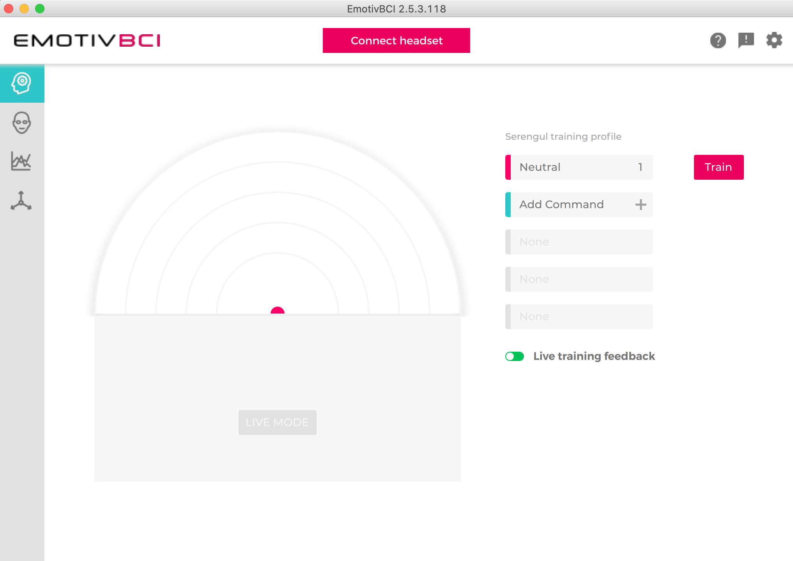
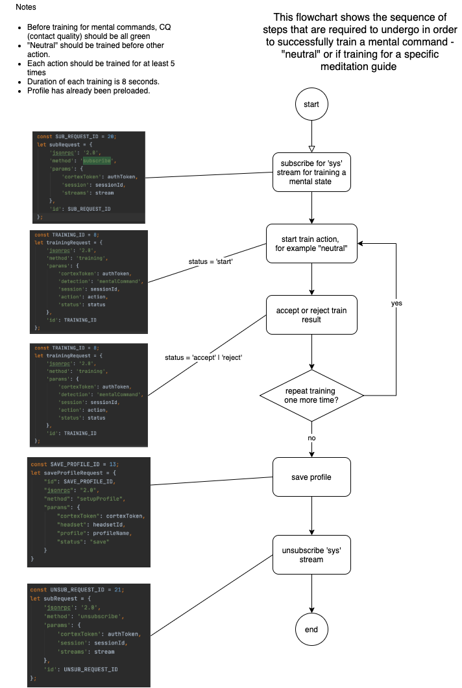
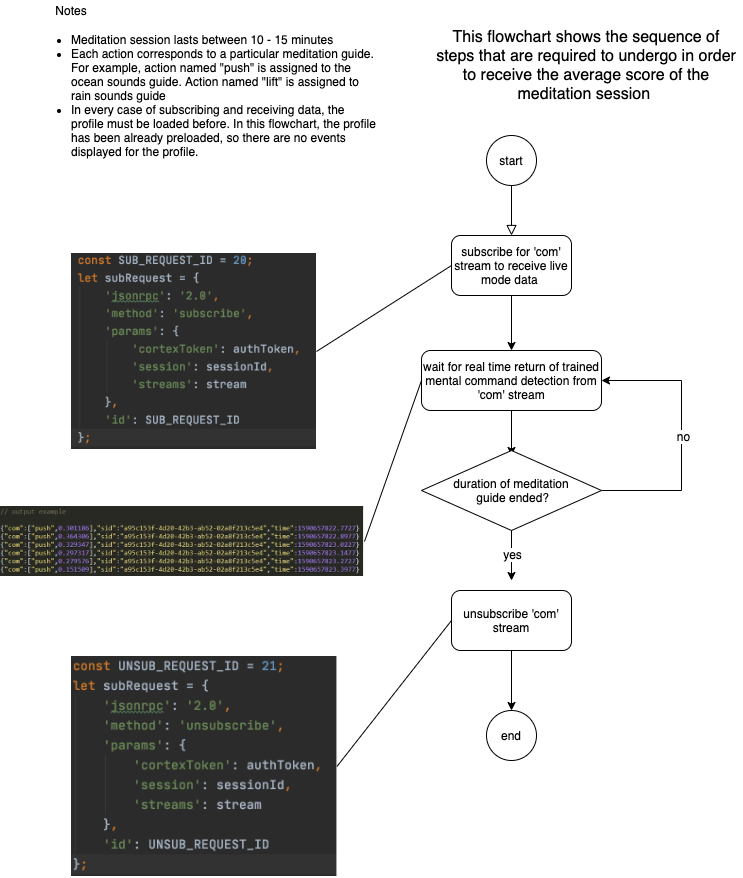

# Core Concepts

### Training Mode

Emotiv BCI training works by detecting various mental commands, otherwise known as actions. If you download the app from their official website, you will see an interface of available actions that you can train and these will react to distinct commands, detecting specific brain activity patterns. For instance, to begin applying various commands, first, you have to make sure you have exercised the "neutral" mental command/action. After the practice, you can select one of the available actions, like push, lift, rotate or others. Once you have chosen the desired mental command, click "Train" and repeat the steps that were required for training the neutral state.

Similar processes are occurring during the training session in the developed app, [Training](app-guide.md#training) page. Some commands are associated with meditation guides. In this particular case, "push" is assigned to Ocean guide, "lift" is part of the Rain guide and Forest has the "pull" command. 

Below you will find a flowchart that describes the training mode in detail.

This flowchart shows the sequence of steps that are required to undergo in order to successfully train a mental command - "neutral" or if training for a specific meditation guide. 

Have you successfully trained your first mental command? If yes, then congratulations! The next step to take is, press Play icon on the wanted meditation guide and follow the instructions. 

### Live Mode

The next concept is the **Live mode**. During the meditation session, the app is trying to detect a brain activity pattern that you have associated with the selected guide. When detection is present, the system gathers the power of the mental command, which varies between 0-1 and saves this data to an array. Every 10 elements that are being put into the array are divided by 10 to calculate the average power of the detection. If the average is lower than 0.5, the volume will increase - causing an auditory cue for the user. In another case, the volume of the guide will be stable or climb up to the volume that was activated before starting the session. 

In the end, you will be prompted an average score of all the averages that were calculated during the session. 

The flowchart below shows the simplified version of a sequence of steps that are required to complete, to receive the average score of the meditation session.

